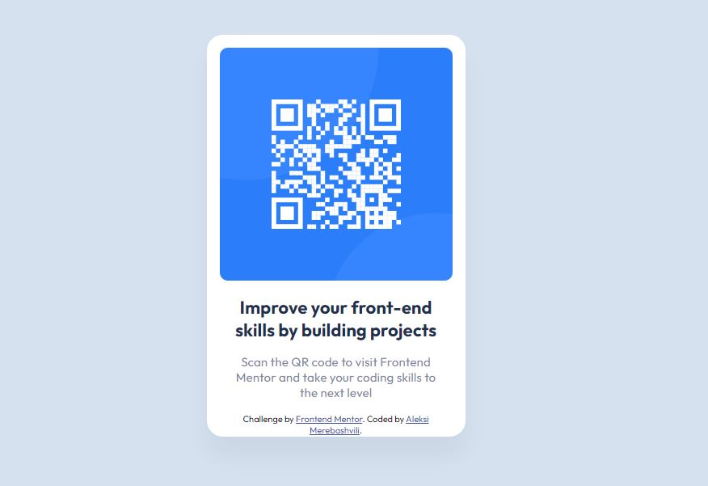

# Frontend Mentor - QR code component solution

This is a solution to the [QR code component challenge](https://www.frontendmentor.io/challenges/qr-code-component-iux_sIO_H). 

## Table of contents

- [Overview](#overview)
  - [The challenge](#the-challenge)
  - [Screenshot](#screenshot)
  - [Links](#links)
- [My process](#my-process)
  - [Built with](#built-with)
  - [What I learned](#what-i-learned)
  - [Continued development](#continued-development)
  - [Useful resources](#useful-resources)
- [Author](#author)

## Overview

### The challenge

My challenge was to build out this preview card component and get it looking as close to the design as possible.
I used tools mentioned below to  complete the challenge. 
Users are able to view the optimal layout depending on their device's screen size.
I added footnotes about challenge source and author of the code.

### Screenshot

This is a screenshot of my work:



### Links

- Solution URL: (https://github.com/Aleqsa123/ntf)
- Live Site URL: (https://aleqsa123.github.io/ntf/)


## My process

### Built with

- Semantic HTML5 markup
- CSS custom properties

### What I learned

I learned laying the elements out, use and insert google fonts. How to insert meta element in html index document for responsive desing usage.

Below are the codes I used, and I think that these are awesome at my level of education in web-development:

```html
    <link rel="icon" type="image/png" sizes="32x32" href="./images/favicon-32x32.png">
```
```css
@import url('https://fonts.googleapis.com/css2?family=Outfit:wght@400;700&display=swap');
```

### Continued development

I have to work more on CSS layout, because for me this was the hardest part of the challenge. Paddings and margins wee also challenge.

### Useful resources

- https://www.youtube.com/@bitcampge - This helped me in starting HTML and CSS.
- https://www.youtube.com/watch?v=BWN7Uz8GIUY&list=PLbZtgfvYfOp3l7dZAnFVfY-bMC6dhP-vO) - This helped me to understand Git Pages and Git.
- [https://developer.mozilla.org/en-US/) - This is an amazing site which helped me understand HTML and CSS basics. I'm going to continue usage of this site.


## Author

- Frontendmentor - [Aleqsa123] (https://www.frontendmentor.io/profile/Aleqsa123)
- Github - [Aleqsa123](https://github.com/Aleqsa123)
- Linkedin - [Aleksi Merebashvili](https://www.linkedin.com/in/aleksi-merebashvili-36627426/)
- Facebook - [Aleksi Merebashvili](https://www.facebook.com/aleksi.merebashvili)